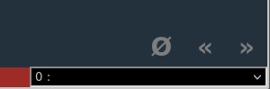

.. Copyright 2022 National Technology & Engineering Solutions of Sandia, LLC
   (NTESS).  Under the terms of Contract DE-NA0003525 with NTESS, the U.S.
   Government retains certain rights in this software.
   
   Redistribution and use in source and binary/rendered forms, with or without
   modification, are permitted provided that the following conditions are met:
   
    1. Redistributions of source code must retain the above copyright notice,
       this list of conditions and the following disclaimer.
    2. Redistributions in binary/rendered form must reproduce the above copyright
       notice, this list of conditions and the following disclaimer in the
       documentation and/or other materials provided with the distribution.
    3. Neither the name of the copyright holder nor the names of its contributors
       may be used to endorse or promote products derived from this software
       without specific prior written permission.
   
   THIS SOFTWARE IS PROVIDED BY THE COPYRIGHT HOLDERS AND CONTRIBUTORS "AS IS" AND
   ANY EXPRESS OR IMPLIED WARRANTIES, INCLUDING, BUT NOT LIMITED TO, THE IMPLIED
   WARRANTIES OF MERCHANTABILITY AND FITNESS FOR A PARTICULAR PURPOSE ARE
   DISCLAIMED. IN NO EVENT SHALL THE COPYRIGHT HOLDER OR CONTRIBUTORS BE LIABLE
   FOR ANY DIRECT, INDIRECT, INCIDENTAL, SPECIAL, EXEMPLARY, OR CONSEQUENTIAL
   DAMAGES (INCLUDING, BUT NOT LIMITED TO, PROCUREMENT OF SUBSTITUTE GOODS OR
   SERVICES; LOSS OF USE, DATA, OR PROFITS; OR BUSINESS INTERRUPTION) HOWEVER
   CAUSED AND ON ANY THEORY OF LIABILITY, WHETHER IN CONTRACT, STRICT LIABILITY,
   OR TORT (INCLUDING NEGLIGENCE OR OTHERWISE) ARISING IN ANY WAY OUT OF THE USE
   OF THIS SOFTWARE, EVEN IF ADVISED OF THE POSSIBILITY OF SUCH DAMAGE.

.. _Methodology:

Methodology
===========

The material in this guide is designed to help capture the lessons we
learned in training vulnerability researchers and shouldn't be taken as a
definitive guide in the proper way to do so. Individual lessons, lessons
learned, principles, inspiration, etc can all be used to tailor a course to
your organization's needs.  Much of this guide can be used as a framework on
which to build a course of your own.  For example, this course and the current
collection of modules is focused around traditional memory corruption style VR.
We strongly believe that principles learned throughout 
the creation of the course could be used to teach a similar course focusing on
other classes of vulnerabilities by changing some of the learning objectives and the
content of various modules.

Bottom Up Philosophy
--------------------

A major theme of the course is the contrast between "bottom-up" versus
"top-down" auditing strategy.  This contrast is also relevant for the way the
course is designed so it is useful to also discuss it here when talking about
the teaching methodology employed.

A top-down approach to vulnerability discovery can perhaps also be
described as the traditional method of VR.  A somewhat dismissive way to
describe this approach is to say, "figure out where input goes into the
program, then read the code until you find a bug."  In the course we teach that
there is a time and a place for this strategy and help students identify when
to use it.  For a person new to VR though, this approach comes with a lot of
problems. Top-down tends to be a more cognitively demanding strategy which
involves keeping track of things like a theoretical call stack and other
complex considerations.  It also tends to be an open-ended strategy that does
not lend itself to any feeling of how much progress you are making.

A bottom-up strategy solves some of the problems inherent to a
top-down approach.  Students are asked to look at functions in isolation, often
at the leaves of the call tree, and are only asked to look for hypothetical
problems that could arise in the implementation of the function.  There are
vastly many more **potential** security issues in code than **actual** security
issues so this gives the students more things to find while auditing.  This
also gives the instructor a better basis on which to judge how often a
student comments about potential issues because they are more frequent and thus
facilitates a more robust feedback mechanism.  Furthermore, bottom-up gives
students and the instructor a sense of relative progress because the time it
takes to complete auditing a single "function unit" is oftentimes merely a
relative delta of what it would take a more seasoned auditor to do.  You can
gain a sense of who is struggling by how much, how little, how slow, or how
fast they are making their way through an assignment.

Even though we ultimately teach multiple auditing strategies in the
course, the foundation that is laid to build up the confidence of a novice
researcher relies on some of the natural aspects of the bottom-up strategy.

Reflections
-----------

Reflecting on what you have learned and on your own progress is a valuable
step in the learning process. This is better motivated in :ref:`Make It Stick
<mis>` and we won't repeat the reasoning behind that here.  Suffice it to say,
both students and instructors found this step to be a valuable addition to the
other traditional elements of the course.  Not only is reflection, "a form of
practice," students are able to look back on their journey of mastering a
difficult skill and internalize the progress they have made.  Instructors are
able to better capture what worked and what didn't work (e.g. validate that a
new auditing task for a module was a good fit) which has been helpful in
shaping the course over time.

Students are expected to keep a diary of sorts that they update weekly with
their reflections.  Their reflections should include in their own words at a
minimum:

#. What they have learned in the past week. *(recall/generation)*
#. How they feel what they have learned impacts their VR goals. *(elaboration)*
#. What they would like to change in order to improve before the next assignment.

Past students have added their own format to their reflections such as
detailed descriptions of the bugs they missed and why. A big part of the reason
for this process in addition to its benefits laid out in "Make It Stick" is
that being a good vulnerability researcher requires people to be learning
constantly.  Having good learning habits, and having a meta-learning approach,
is something that is beneficial for doing VR beyond the course.

Tools
-----

For source code auditing, the traditional tool used at Sandia is *Snippet* which
is a custom source code viewer that allows for collaborative inline annotations.
There are a few reason why Snippet is an ideal tool for teaching.  First of all,
the ability to perform inline annotations fundamentally reduces the difficulty
in creating artifacts while auditing.  Second, you can remotely track students
annotation activity including timestamps. Timestamps are very useful for gauging how
frequently students are interacting with the auditing task.  Finally, Snippet's
auditing databases can be merged so that students can compare their audit results 
with others including the instructors.

A con of using Snippet is that it is a tool in decline.  Current efforts
are being made to implement features similar to Snippet in IDEs but that work
is still ongoing at the time of this edition of the guide.  Ultimately, you
should pick the tools that are most representative of the real world environment
you expect the students to work in following the class.

Other tools to keep track of auditing results are wiki software such as
Gitlab, or collaborative tools such as OneNote.

For binary auditing, we exclusively use `Ghidra <https://ghidra-sre.org>`_
and recommend it highly.  Many of the features that Snippet has, such as
collaborative annotations, were inspired by Ghidra.

Spot The Bug!
-------------

Spot-The-Bug (STB) exercises can be a great way to break up the doldrums
of a lengthy lab week or give you an opportunity to subtly introduce new bug
classes to your students.  Furthermore, if any new bugs hit the news, this can
be a good chance to see if you and your students are up-to-snuff compared to
the outside world.  STB should be a short exercise that takes 10-30 minutes to
see the flaw in the code.  Any less than that and it is probably too simple,
any more than that and it might be too complex and take away from time spent on
any lab or other assignment that is currently pending.

Creating good STB exercises involves a lot of curating of the code that your
students look at.  You need to provide enough context that the code snippet
clearly shows a bug but not so much code that it takes too long or the students
are led astray but other non-issues.  If they know a bug is there, it can taint
their objectivity.  You can mine CVE patches for bits of code where bugs can
be spotted for these exercises or can tap the history of the kinds of bugs
found in real life mission scenarios.

A number of STB exercises curated from CVEs is available in the
:ref:`Resources <Resources>` section.

You can run a STB exercise in a couple of ways.  One way is to have
students shout out when they see something.  This can be distracting because
many non-issues sometimes creep up, but you gain the benefit of sharing
"live" insight among the students.  Another way is to give the students a time
limit and tell them to chat the instructor with what they think the bug might be
(e.g. via Mattermost, Skype, or other messaging service on your network).  You
can hand out small prizes or badges of honor to the person who finds the bug
first.  For example, at Sandia, we keep around a stuffed unicorn that the
person who finds the bug gets to keep as a trophy to be defended at the next
STB exercise.

Class Structure
---------------

The VRDP course is structured into modules, each of which adds a new
concept and a task that allows the students to practice that concept over the
course of the module's duration.  Most modules are a week long but some exceptions
are made for more complex concepts.  There are no hard and fast rules but the basic
rhythm of `introduce a new concept -> audit to practice that concept` keeps the
expectations simple and is one of the key defining characteristics of how the
course is organized.

Historically, modules are correlated with weeks.  A module usually takes one
or more weeks depending on the material or the auditing exercise assigned.

One week example outline
++++++++++++++++++++++++

A basic week-long structure for organized class activities is as follows but
can be adjusted depending on scheduling circumstances. For example, at Sandia,
staff are allowed to work a 9/80 schedule which means that different students
may or may not be there on a given Friday.  Students who worked an alternate
schedule were simply required to spend 20 hours a week on class activities and
could spread out the Friday tasks on their off week however they desired.
Rather than force students to switch to a standard schedule, organized
activities were concentrated on Monday-Thursday while Friday was left
explicitly for writing reflections, reading, catch up, or further auditing time
should that be desired.  Regardless of the particular weekly schedule you
choose, you are encouraged to schedule reading time as part of class hours both
to make sure that the reading is done and so that students have an alternative
to auditing as breaks are necessary.

Monday starts out with a lecture, discussion, or other group activity
depending on the module.  This is the day when the learning objectives should
be clearly articulated to the students.  You might do a STB exercise that is
along the same theme of what the weekly module is (e.g. find a good integer
overflow CVE for the C Language module).  If you have been waiting to address
certain questions the students have had so far, Mondays are also a good time to
take some minor diversion since the entire class is already engaged.  Finally,
introduce the auditing task for the week and if there is any remaining time,
let the students get started setting up their repo, wiki, etc and start
engaging with the assignment.

Tuesday and Wednesday should be protected from interruptions as much as
possible in order to allow the students to engage substantially with the
auditing task for the week.  One exception can be a warm-up activity such as a
STB exercise. Based on feedback from students over the years, they really look
forward to the STB portions and it breaks up the monotony of auditing. While
students are auditing, the instructor should be following along with their
progress and providing feedback when necessary.  Each student should receive
some kind of feedback at least once during the two day period.  It is often
best to remove the student from the room to discuss their thought process or
auditing progress to avoid distracting or tainting the experience of the other
students in case they overhear you discussing the code.  You can also do this
over chat if feasible.  In the remote version of the course, feedback was
given in breakout rooms which worked quite well.

Thursday should primarily be for group feedback although you can tailor
when you start based on how much time you feel you need to discuss the module
or how much an extra hour of auditing might help the students.  Early on in the
course, it is helpful to have audited the code yourself and have an example of
the artifacts you produced.  It is also helpful early on for the students to
see examples of other students' progress.  If you are using Snippet, you can
easily do this by merging the annotation repos of the entire class.  It might
make for a chaotic screen though. You might try this before you start the
group feedback session to see if it helpful or not.  Another way to go about
group feedback is to pick a student you feel did a good job and highlight their
annotations.  Try to choose a different student each time if possible
so that you can spotlight each in turn.  Even if the student didn't catch
everything, if they are improved or their process looks clean, you can still
use their annotations to drive the group discussion.

Make sure you take Thursday to highlight the big picture of what everyone
was trying to accomplish that week.  Tie the auditing results (success or
failures) back to the learning objectives.  It is okay if everyone did not find
what was supposed to be found or if they didn't find anything in the case of an
open ended audit task.  Very often it is the failures or missed bugs that cause students to
reflect on their process, rigor, or foundational knowledge the most and you
hopefully will see more drastic changes in the behavior of students that missed
a bug on future modules.

Friday, all students should complete their weekly reflections by the end of
the day.  Additionally, they should complete any unfinished reading.  After
that, students have time to explore supplemental reading, browse for articles
or content related to the learning objectives, or simply go back and audit more
of the code they didn't get to.  (Just because some modules have known bugs
doesn't mean the rest of the code doesn't have other 0-days!)

Changes for a 2 week module
+++++++++++++++++++++++++++

For a two week module or lab, it is useful to add some more group
activities between the Monday introduction and the subsequent Thursday group
feedback.  You can add more STB exercises (e.g. on the first Thursday), have
group discussion about the reading topics, or do a mini group feedback about
anything that was found so far.  Students should still do their reflections on
both Fridays.

Lectures
--------

All modules have a slide deck associated with them.  Each slide deck also
contains an instructor script to use as a basis for delivering a lecture.  The
script can be accessed by looking at the slides in outline mode.  In the lower
left of the slide deck is a navigation window for quickly jumping to a
particular slide.  This navigation will only appear when you hover over the
corner of the window with a mouse. The O with a line through it will change the
view to outline mode.

The instructor script is rendered in green along with a plain version of the content
on the slides.  You can of course deviate from this script.  It is merely meant to be
a way to capture roughly what lecture delivery has looked like in the past without
the cumbersome nature of a video.

Giving Feedback
---------------

One of the significant features of VRDP is instructor feedback.  Most of
the time spent in class is the students applying the knowledge and periodically
checking in with the instructor.  Growth happens in an iterative fashion between
feedback session.  Don't let students get away with being silent for a majority 
of a module. You should have a minimum of 2 feedback sessions with each student
per week.

Each module involving significant auditing should have a **Rubric** section
in the instructor guidance that covers what you should be looking out for during
feedback for that module.  None of them should be too surprising.  For example,
if you just talked about control flow, you should be looking for evidence in their
annotations that they have been more careful around complex loops or branching
paths.

Group feedback is also important.  As described before, this is a good
chance for students to see a different style of auditing, especially if you
curate what is shown to examples where someone has excelled.

Finally, another thing you can do if there is any dead time between feedback
is to offer to pair or group audit.  In an in-person setting, this can involve going
to a space where a monitor can be shared.  In a remote setting, a breakout room
can be used.  Have one person, even yourself as the instructor, drive the focus
of the auditing while everyone is encouraged to add their thoughts.  When
trying this, it seems like 3-4 people is a good limit for these sessions.

Developing New Modules
----------------------

While there is something to audit for each portion of the course, you can
change the focus depending on how much you want to increase the opportunity for
finding new bugs.  You can choose code to audit based on the kind of code that
it is rather than if it has known bugs in it in order to give students a chance
at finding new bugs (e.g. choose a parsing module of some larger code base for
the section on string bugs).  It is probably a good idea for you to audit the
code in advance to see if it is a good fit for the learning objectives.  Since
you should primarily be providing feedback based on a students process and
reasoning, there is no technical reason not to always look at code with no
known bugs.  There is a balance you need to strike though between the feeling
of accomplishment the students feel when finding a bug and the excitement of
potentially finding a 0-day.  A lot can be learned by the character of existing
bugs and the allure of something to find is also motivating in its own right.

Creating new modules consists of the following all of which you should see
clearly in the :ref:`Modules <Modules>` section:

#. **Define the learning objectives.**  It is important to be clear what the
   students are expected to get out of the modules.  As a general rule, try to
   limit the objectives to one process element, one language pattern, and one
   new tool or technique at most.  That way students can really focus in on
   what you want them to learn that week.  This should be cumulative so you can
   set the expectation that students will be critiqued based on all of the
   prior modules.
#. **Find relevant STB exercises.**  Plan ahead for some class activities.  Just
   make sure the bugs you are showing are not way over the student's head for
   where they are in the course (e.g. don't show some complex shmem race
   condition week 1).
#. **Design an auditing task based on the learning objectives.**  This can often be
   the hardest thing to do if you are not reusing one of the existing modules.
   You should generally tell students where you want them to start because
   picking good places to start auditing something fresh is a skill in and of
   itself that is learned over the scope of the whole course.  Students will
   have an opportunity to explore this in open ended modules as part of their
   planning on how to attack a new piece of software where you will be able to
   impart your own wisdom.  For the modules with known bugs, give them a set of
   files or modules that you want them to start in so you are judging them all on
   the same playing field and you have the same basis on which to compare
   auditing artifacts.

   Open source software is obviously a great place to mine for good auditing
   targets.  Usually CVE lists are available for software if you want to look
   for examples of certain bug patterns or you can look at commit logs for
   security relevant issues.  You can pick software that has been in the news
   recently for having bugs or you can choose based on software that contains
   the kind of code you want them to be looking at in order to more effectively
   exercise their recognition of a new set of patterns you have introduced in
   class.

