.. Copyright 2022 National Technology & Engineering Solutions of Sandia, LLC
   (NTESS).  Under the terms of Contract DE-NA0003525 with NTESS, the U.S.
   Government retains certain rights in this software.
   
   Redistribution and use in source and binary/rendered forms, with or without
   modification, are permitted provided that the following conditions are met:
   
    1. Redistributions of source code must retain the above copyright notice,
       this list of conditions and the following disclaimer.
    2. Redistributions in binary/rendered form must reproduce the above copyright
       notice, this list of conditions and the following disclaimer in the
       documentation and/or other materials provided with the distribution.
    3. Neither the name of the copyright holder nor the names of its contributors
       may be used to endorse or promote products derived from this software
       without specific prior written permission.
   
   THIS SOFTWARE IS PROVIDED BY THE COPYRIGHT HOLDERS AND CONTRIBUTORS "AS IS" AND
   ANY EXPRESS OR IMPLIED WARRANTIES, INCLUDING, BUT NOT LIMITED TO, THE IMPLIED
   WARRANTIES OF MERCHANTABILITY AND FITNESS FOR A PARTICULAR PURPOSE ARE
   DISCLAIMED. IN NO EVENT SHALL THE COPYRIGHT HOLDER OR CONTRIBUTORS BE LIABLE
   FOR ANY DIRECT, INDIRECT, INCIDENTAL, SPECIAL, EXEMPLARY, OR CONSEQUENTIAL
   DAMAGES (INCLUDING, BUT NOT LIMITED TO, PROCUREMENT OF SUBSTITUTE GOODS OR
   SERVICES; LOSS OF USE, DATA, OR PROFITS; OR BUSINESS INTERRUPTION) HOWEVER
   CAUSED AND ON ANY THEORY OF LIABILITY, WHETHER IN CONTRACT, STRICT LIABILITY,
   OR TORT (INCLUDING NEGLIGENCE OR OTHERWISE) ARISING IN ANY WAY OUT OF THE USE
   OF THIS SOFTWARE, EVEN IF ADVISED OF THE POSSIBILITY OF SUCH DAMAGE.

.. _ghidra:

Ghidra 
==========

There is a lot to Ghidra and you should definitely explore it.  This guide will
show you the basics and what you need to tackle the modules in VRDP.

Get ghidra from here: `https://ghidra-sre.org <https://ghidra-sre.org>`_.

In this tool guide, we will be examining the following binary
(`unknownlib.so <../../../_static/unknownlib.so>`_).  Download it to your system
and get ready to brave the multi-headed monster!

Project Creation & Binary Import
------------------------------------

When you first launch ghidra by click on or running ``ghidraRun`` or
``ghidraRun.bat`` (windows) you should see this screen:

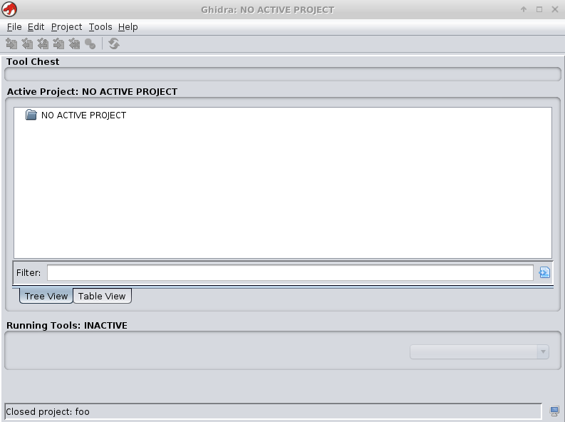

Starting from here, do the following:

 #. Select ``File -> New Project``.
 #. Choose ``Non-Shared Project`` and click ``Next``.
 #. Select a location and name your project, anything that you will remember.
 #. Select ``File -> Import File``.
 #. Browse to the binary you want to load.
 #. Click ``Ok`` whenever prompted to accept defaults.

Through the import process, you will see some of the import options that
Ghidra will give you.  You can pick the binary format, architecture, load
address, and all kinds of cool stuff.  Mostly, you will never need to do that
unless you are in a specific circumstance.  Loading a "normal" binary that has
a valid header is often well supported by Ghidra.  The summary of the import is
the last thing you see which will tell you everything Ghidra chose for your
binary.  When you are done, your project screen should look like this:

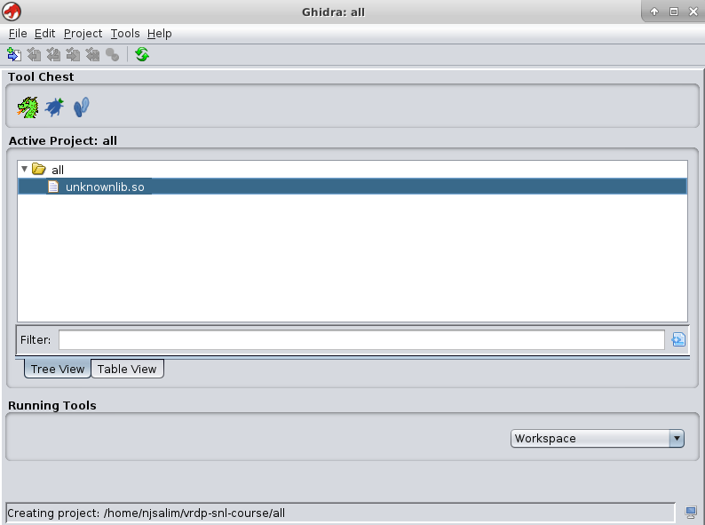

Code Browser Tool & Analysis
--------------------------------

Double click on your newly imported binary and it should open in the Code
Browser Tool.  If that doesn't work, drag the binary onto the green dragon icon
in the ``Tool Chest``.  The first thing it will ask you is if you want to
analyze the binary, say yes and accept all the defaults.  Just like the import
process, sometimes you need to fiddle with those analysis options but for most
well-behaved binaries the defaults are perfect.  Thankfully in VR, you are
mostly dealing with software that wants to be well behaved.  Occasionally you
will run into software with anti-debug measures even in commercial software.
After you get past the analysis screen, Ghidra will process for a moment and
then drop you into a set of windows similar to below:

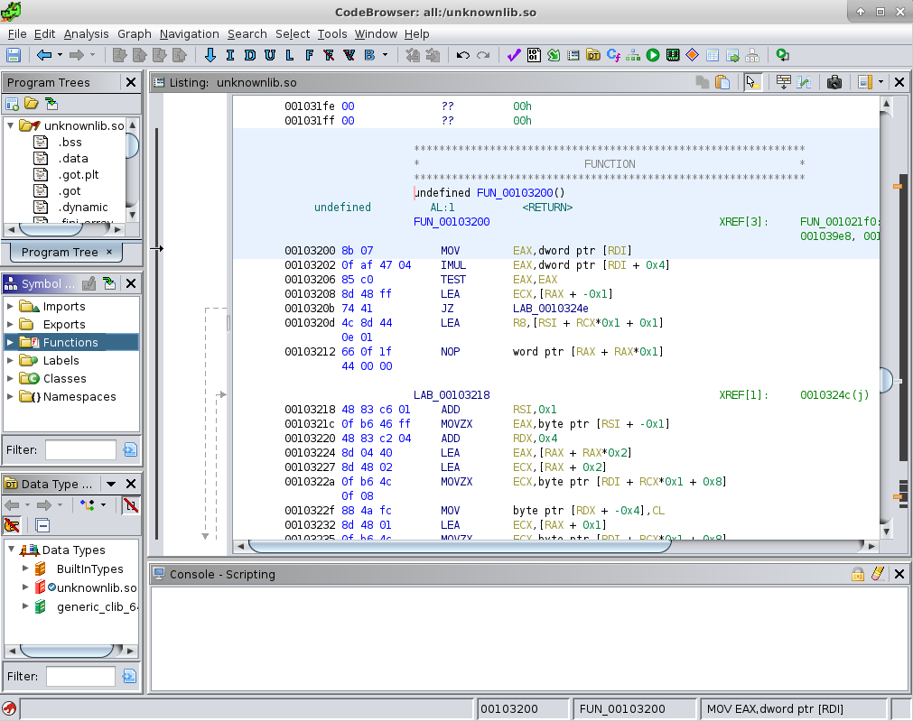

The open windows are just some of the ones that are available.  Many more
can be accessed under the ``Window`` menu as we shall soon see.  You can also
move them around, expand them, break them out into their own independent windows,
close them, all to fit your personal workflow.

The largest window by default is the "Listing" window.  It has the disassembly
output along with helpful connections such as "xrefs" which will help you navigate
to related parts of the binary.

The smaller windows on the left, from top to bottom are:

* **Program Trees** - A summary of the programs and their various memory regions.
* **Symbol Tree** - A very useful window that will help you find things by symbol names if you have them.
* **Data Type Manager** - A list of the types that Ghidra knows about in relation to this binary.

.. note::

 The Ghidra listing view starts out with a "feature" that everyone hates.  Namely,
 it tries to show you variable names in place of machine registers or memory
 addresses.  This can actually make it more confusing to analyze code in the
 Listing view.  Turn this off by navigating to ``Edit -> Tool Options -> Listing Fields -> Operand Fields``
 and uncheck anything that starts with the word ``Markup``.

 .. figure:: ../../../_static/ghidra_listing_markup.png
   :scale: 75%

Scripting
-------------

Outside of Ghidra, download the `Archaea <../../../_static/Archaea.py>`_ script
and place it in your home directory under ``ghidra_scripts``.  This directory should
have been created for you when you launched Ghidra.  Scripts can be used to many useful
repetitive activities and can be written in Python and Java.  Script writing is out of
scope for this guide but we will be using this script to get us started.

With the script in place, open the Script Manger by going to ``Window -> Script Manager``.
It should look like this:

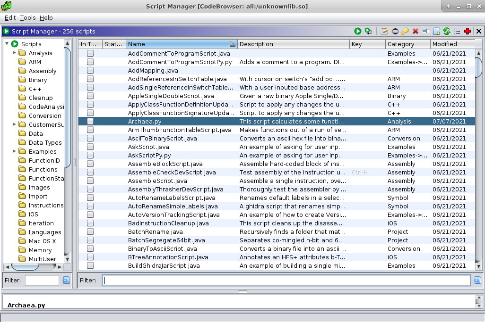

Double click ``Archaea`` from the script list and you should get a result
window.  You may need to stretch it a bit to look like this:

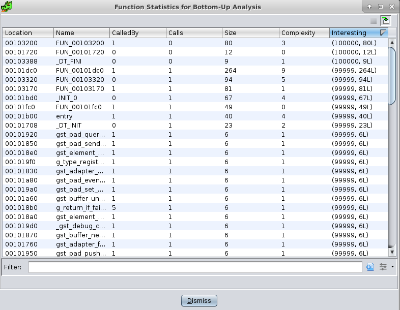

Let's get into what this script is doing and why you should care.  It is a
subject of ongoing research how to use the "bottom-up" strategy when given a
binary.  In previous modules, you were either told where to start or used some
intuition to figure out where the "bottom" was.  In a binary, everything is flat
and so it can be overwhelming trying to figure out where to start especially if
you would like to use the bottom-up strategy.  This script lists functions in
the binary by how many other functions call them, how many functions it calls,
and how big it is.  The "Interesting" column is a tuple of functions that have
low numbers of calls themselves yet are large in size.  So essentially the
functions near the top when sorting by this column are the, "largest functions
near the leaves of the call tree."  Click on the first row in the results
and you may notice that the Listing window will navigate to that function.

In the Listing window you can use the bookmark feature of Ghidra to save
your place. Right click on the first address of the function and choose
``Bookmark``.  Label the bookmark ``Interesting1``.  You should see a purple
check mark appear in the Listing window to the left.  Open the Bookmark window
by clicking ``Window -> Bookmarks``.  It should appear in the same space as the
Console and you should see your bookmark in that list:

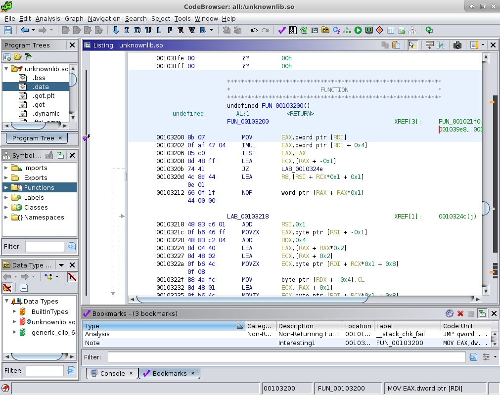

Decompilation
-----------------

Looking at disassembly to understand code is hard.  Luckily, we don't have to!
Click ``Window -> Decompiler``.  If you have a big enough screen, it is useful to
have this in its default location next to the Listing window. You can also drag it
into the Listing window which will make it share the same space as was done in
this screenshot:

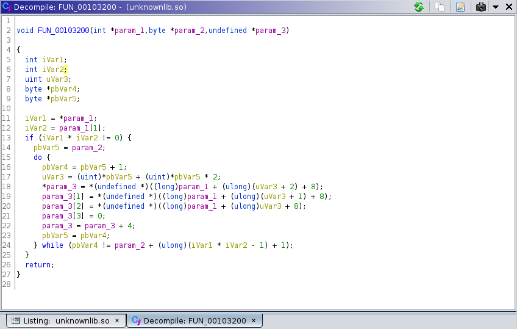

Ghidra tries its best to give you a C-like representation of the function and
it actually does a decent job most of the time.  Where it often gets it wrong are
in the following areas:

 * The number of function arguments
 * The type of function arguments
 * The number of and layout of local variables
 * The type of local variables
 * Identification of structures vs arrays

There are many other things that when Ghidra does guess wrong, the code might look
hard to read, but it is still easier than disassembly.  Your job as a vulnerability
researcher is to apply good process to understanding the code.  As you should have
heard in a lecture, the name of the game for RE+VR is to apply fix-ups to the code
in addition to commentary that helps you understand it.  The artifact in this case
is not just your annotations, but the self-documenting nature of helping Ghidra
show you a more accurate representation of the code if you can.

Annotations
---------------

Speaking of annotations, you can annotate items in Ghidra just like you
would in Snippet.  Snippet was inspired by Ghidra in fact!  Just hit ``;`` or
right click to add an annotation on a line of code or assembly instruction.
In Ghidra there are various types of annotations but the "plate comment" is
good for this circumstance.  Feel free to experiment with the comment types.

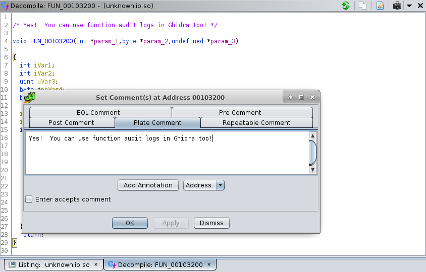

Fixing Arguments
--------------------

There are many ways to start but one thing we can wonder about is if
Ghidra got the arguments right and if we can understand what they are for.
Middle click on ``param1`` just like you would a variable in Snippet and
it should be highlighted everywhere it is used.  In this case, it appears
that ``param1`` is already read from.  In two cases on lines 13-14 it
is read as an ``int`` but then on lines 20-22 it is read as an ``undefined``
which is a 1-byte value and is done so at strange offsets from the beginning
of the pointer.  This is a reasonable indication that what we are dealing with
is actually a structure and not an array of integers.  The first two things
in the structure appear to be integers and then there is some kind of
arbitrary "stuff" past that.  So we might hypothesize that it looks like this:

.. code::

 struct UnknownStruct {
     int i1;
     int i2;
     char buf[0];
 }

.. note::

 Don't worry too much about making modification.  You can always undo your
 changes until you hit save.  Only hit save when you are happy with your tweaks.

This is a common paradigm for dynamic sized structs.  First, we will let
Ghidra give its best guess.  Right click on ``param1`` and select ``Auto Create
Structure``.  Ghidra will try its best and come up with the following:

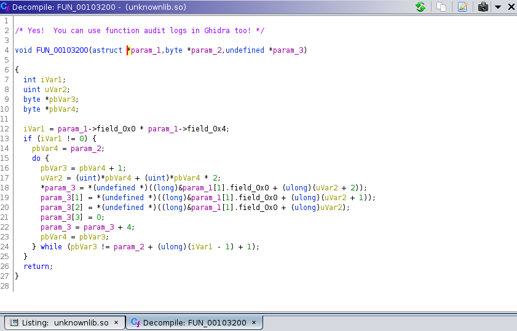

Some things look a little better but it looks like Ghidra didn't get it
quite right.  Let's improve the situation.  Ghidra created a new structure
called ``astruct`` with its best guess at what it contains.  Click on ``astruct``
and choose ``Edit Date Type``.  You should get the following window:

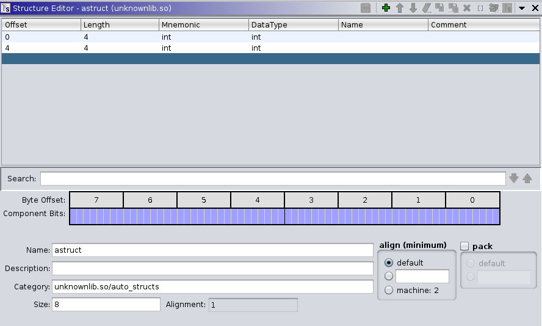

Clearly Ghidra is confused.  It knows that the two integers are part of the struct
but it didn't know what to do with the arbitrary space past it.  Now unfortunately we
cannot tell Ghidra that this object might be dynamic, so we just have to give the
data at the end of the buffer a certain size.  Click the empty part of the field
table and then click the large plus icon.  Add a field called ``buf`` that is of
type ``char[100]``.  Also rename the fields to ``i1`` and ``i2`` and the structure
to ``UnknownStruct``.

.. note::

 Naming things something generic might not seem like a big improvement but it is
 a good practice to do as you reverse engineer.  Even if you can't give something
 a meaningful name, renaming it to something else generic is a signal to yourself
 and others that you have thought about it and that the names are just Ghidra's
 generic guess.  A good rule is, if you touch it, rename it.

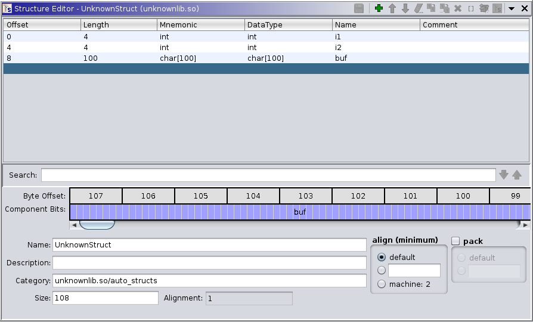

With that, we get an immediate improvement in the decompilation once we
close the type editor:

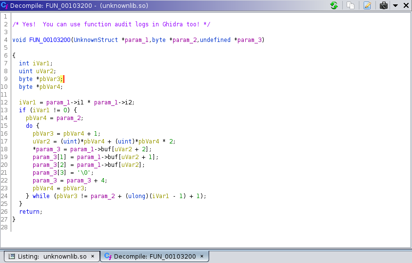

With just the ability to right click on a type to change it or right click on
a variable to rename it, we can do some obvious things in quick succession.

 * To indicate that we know stuff about the first argument, rename ``param_1`` to ``obj``.
 * ``uVar2`` appears to be an index into the buffer so rename it to ``index``.
 * We know that we are pulling individual bytes out of ``buf`` into
   ``param_3``, so retype ``param_3`` to a ``byte *`` and rename it to
   ``dst`` since it looks like its the destination of the copying that is
   happening here.

With that, the code is starting to look a lot nicer, but we still don't
quite understand ``param_2`` and how it interacts with some of those local
variables.  We also don't fully understand our loop condition involving
``param_2`` and ``iVar1``.

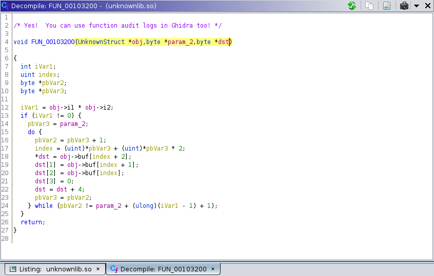

The next part to decipher is the relationship between ``param_2`` and
the remaining local variables.  There is a pattern thought that should make
some sense if you think about it.  Consider the following:

.. code::

 pbVar3 = param_2;
  ...
 pbVar2 = pbVar3 + 1;
  ...
  <pbVar3 is used>
  ...
 pbVar3 = pbVar2;

First ``param_2`` is aliased to some other variable ``pbVar3``.  That
variable is incremented but its original value is used in computation.  Then
later it is updated with its incremented value.  This is exactly how the
post-increment operator works in C.

The only value that is affected by this is ``index`` which is computed
from a value read at that pointer.  So it looks like ``param_2`` is list of
indices.  Let's call it that and update the temporary variables to help
us keep track.  Finally, we can see what the loop condition really is.  ``iVar`` is
the distance from where ``param_2`` started based on those first two integers
in the struct.  Together multiplied, they are related to the size of the
the ``param_2`` array and the ``buf`` array inside the object and the ``dst``
array where we are writing!  If you name everything accordingly, you may
choose something like this:

.. figure:: ../../../_static/ghidra_decompile5.png
  :scale: 75%

Now can we figure out what this is doing?  It appears to be copying
a set of 3 bytes from the object buffer into some destination buffer but
padding it with a 4th byte that is always zero.  It is also reversing
the order of the three bytes as it does it.

At this point, you don't have enough information to know **why** this
function exists, but you do have enough to make a reasonable hypotheses
about its safety.  Everyone by now should be able to write a function
audit log that calls out some clear potential issues.  We can also
name the function.  A convention many people who use Ghidra do is to
put question marks in names when they aren't sure of the purpose or
name of a function.  The more question marks in the name, the less certainty.

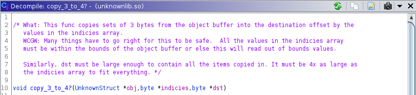

If we wanted to chase down a hypothesis, we could follow the ``XREF``
fields back in the Listing view.  By clicking on those we can travel to places
where this function is called and attempt to RE those ones as well.  This
particular function is only called once and the function that calls it is quite
large.  Instead, take the remainder of the time to practice some of these
concepts in another one of the small functions we listed earlier.

Search for the function with the name ``FUN_00101dc0`` in the Symbol Tree
window.  This is a slightly larger function but you should be able to clean it
up using some of the tricks shown so far.  Can you get to the point where you
understand this function? Can you find anything wrong with it? Have you seen
anything like it before?

