.. Copyright 2022 National Technology & Engineering Solutions of Sandia, LLC
   (NTESS).  Under the terms of Contract DE-NA0003525 with NTESS, the U.S.
   Government retains certain rights in this software.
   
   Redistribution and use in source and binary/rendered forms, with or without
   modification, are permitted provided that the following conditions are met:
   
    1. Redistributions of source code must retain the above copyright notice,
       this list of conditions and the following disclaimer.
    2. Redistributions in binary/rendered form must reproduce the above copyright
       notice, this list of conditions and the following disclaimer in the
       documentation and/or other materials provided with the distribution.
    3. Neither the name of the copyright holder nor the names of its contributors
       may be used to endorse or promote products derived from this software
       without specific prior written permission.
   
   THIS SOFTWARE IS PROVIDED BY THE COPYRIGHT HOLDERS AND CONTRIBUTORS "AS IS" AND
   ANY EXPRESS OR IMPLIED WARRANTIES, INCLUDING, BUT NOT LIMITED TO, THE IMPLIED
   WARRANTIES OF MERCHANTABILITY AND FITNESS FOR A PARTICULAR PURPOSE ARE
   DISCLAIMED. IN NO EVENT SHALL THE COPYRIGHT HOLDER OR CONTRIBUTORS BE LIABLE
   FOR ANY DIRECT, INDIRECT, INCIDENTAL, SPECIAL, EXEMPLARY, OR CONSEQUENTIAL
   DAMAGES (INCLUDING, BUT NOT LIMITED TO, PROCUREMENT OF SUBSTITUTE GOODS OR
   SERVICES; LOSS OF USE, DATA, OR PROFITS; OR BUSINESS INTERRUPTION) HOWEVER
   CAUSED AND ON ANY THEORY OF LIABILITY, WHETHER IN CONTRACT, STRICT LIABILITY,
   OR TORT (INCLUDING NEGLIGENCE OR OTHERWISE) ARISING IN ANY WAY OUT OF THE USE
   OF THIS SOFTWARE, EVEN IF ADVISED OF THE POSSIBILITY OF SUCH DAMAGE.

.. _ghidra_cpp:

Ghidra for C++
==================

Before reviewing this, you should go check out the basic :ref:`Ghidra
<ghidra>` tool guide.

Basic Resources
-------------------

Much of this was adapted from ideas learned from here:
http://hwreblog.com/projects/ghidra.html

The following articles have some great fundamentals about C++ object and
vtables which is one of the main reasons for this tool guide.  Confronting
these when doing C++ RE is a huge part of what makes this kind of RE hard:

* `<https://www.martinkysel.com/demystifying-virtual-tables-in-c-part-1-trivial-constructors>`_
* `<https://alschwalm.com/blog/static/2016/12/17/reversing-c-virtual-functions>`_

Vtables!
------------

When you declare a C++ class, because of possible inheritance, the compiler has
to do lots of extra work to prepare for a situation where it needs to decide which
function to call at runtime, not compile time.  For that it uses function pointers
and in this case function pointers in a special place called a *virtual function
pointer table* or vtable for short.

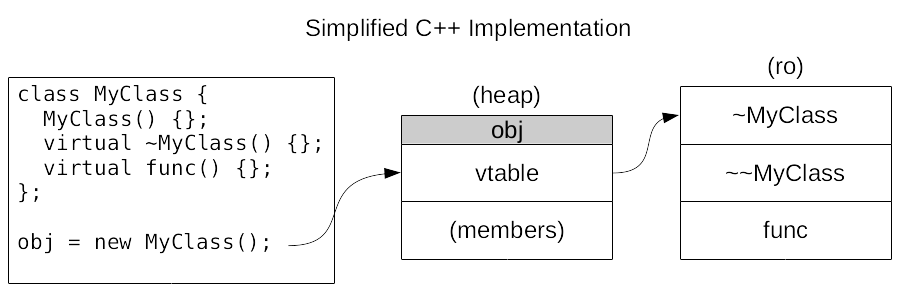

The C++ spec gives compilers a lot of latitude on exactly how to implement
classes but for most part, when an object is allocated, the first item in its
actual memory layout will be a pointer to a location with a list of function
pointers for any function declared virtual.  While it doesn't have to be, often
the destructor is first because it makes walking the destructor chain easier.
The next function, at least in gcc, is a special function that actually calls
the ``delete`` method when the destructor is finished.  Finally the virtual
functions are listed from there.

Simple C++ Example
----------------------

While we try hard to use real code in VRDP, in this case we are going to
use a toy example to baby step into the world of C++ RE.  If you want to
follow along, get this (`cppre <../../../_static/cppre>`_) binary and load it up
into Ghidra.

The first thing to note is that this binary is stripped, so we have to find
main.  That is easy.  There should be a symbol called ``entry`` and in there
you should see a call to ``__libc_start_main``.  The first argument to that is
the address to main.  Rename it and go there.

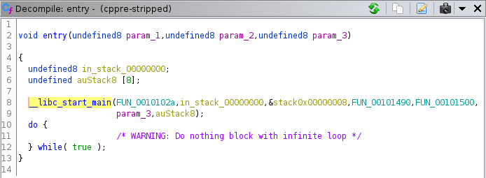

Discovering C++
___________________

If we look at the decompiler window, we see a bunch of ugly code.  If all
the complex references to things that look like standard template library stuff
doesn't give it away, there are some other giveaways that this is C++ code.
For starters, there is a call to ``new`` which is the allocator for C++ classes.
The combination of ``new`` with a function call involving the return value from
``new`` is a common thing you will see as C++ objects are created.  That first
function is likely an object constructor! Moreover, we have a great piece of
information here.  In the call to ``new`` we know how many bytes the compiler
things this object should take.  In this case it is 0x28 so let's remember
that for later.

The other thing to note is this ugly syntax involving ``code *`` types.
This is code you will see both in C and in C++ as Ghidra tries to grapple with
function indirection.  In this case, because you know it is happening to
something you have already determined is probably a C++ object, and because the
function pointer looks like it is coming from the first part of this object
which we know from above is a pointer to a vtable, this is likely a virtual
function call.  So how do you get to the function that this is calling?  First
we need to do some work.

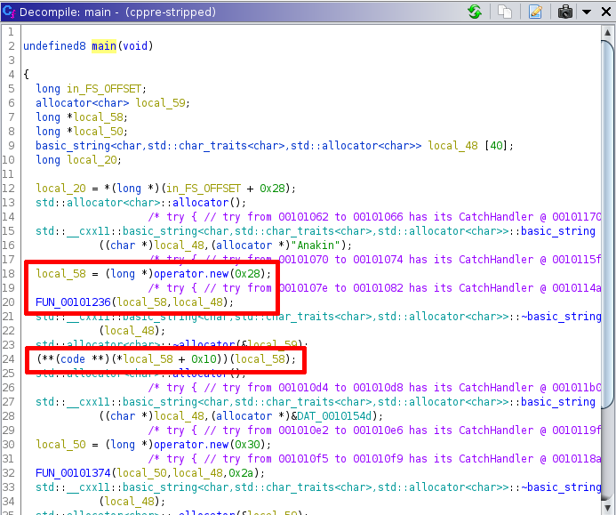

Navigate to that first function call after ``new`` that we guess is a
constructor.  You can confirm that it is a constructor by noticing that the
first thing that it does is assign a pointer to the beginning of memory.  If
you want to go peek at the location in memory you should see a table of
function pointers, but we will get there naturally soon.

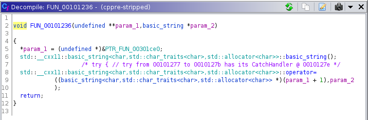

Let's start by doing what we would normally do when an argument
to a function looks like it should be a struct.  Right click on the
type to the first param and use the ``Auto Create Structure`` to let
Ghidra take its best guess.

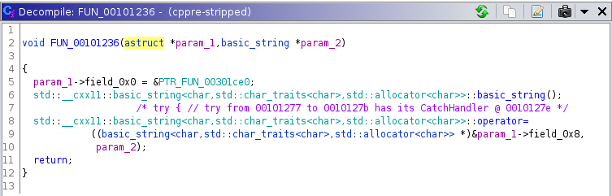

Right click and edit the data type that gets created.  We can
start with fixing the size which Ghidra gets wrong.  Make it 0x28 or
40 decimal.  Then we can fix up at least two of the items in this object.
We know the first thing is a pointer and the second thing looks to also
be a pointer to a ``basic_string``  Add those fix ups and call your new
structure something.  For this example we'll call it Steve.

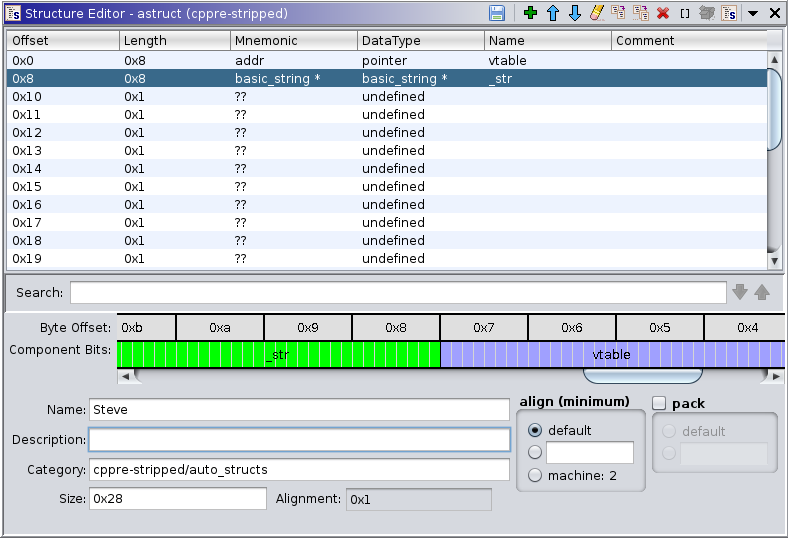

Next head over to the Symbol Tree window in Ghidra.  In there you
can look at the list of classes.  What we want to do is add a class
called Steve.

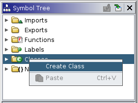

Now that the class exists, you can rename the function.  We are pretty
sure it is a constructor so let's call it ``ctor`` but put in the scoping
syntax as shown:

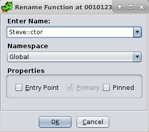

What that will do is show you the function inside the Symbol Tree window
so you can easily navigate to all of the functions in Steve.

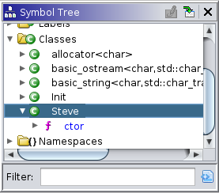

Finally, you can rename ``param_1`` to ``this`` to denote that this is a member
function of a class. The end result should look something like this:

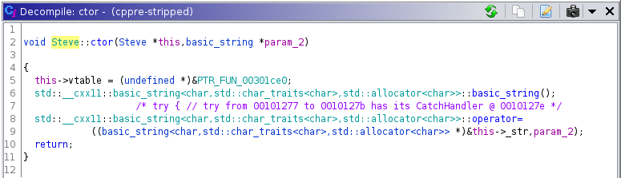

Dealing with vtables
_________________________

Now let's move on to the vtable for this object Steve.  Double click on
the symbol inside the constructor and it should take you to a section in memory
that looks like this in the listing view:

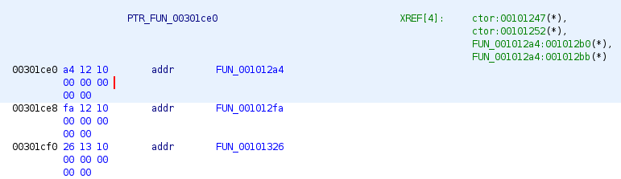

You can go confirm that the first two functions look like how a vtable
is described.  The first one should be a destructor, the second should call
``delete`` while the third remains a mystery.  Rename the functions here
accordingly.  Use the same scoping syntax to bind them to Steve.

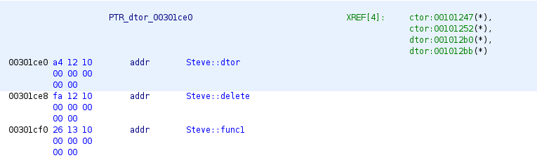

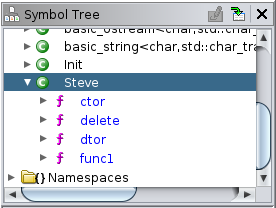

Now select the function pointers all together, right click, and choose
``Data -> Create Structure`` name it ``Steve_vtable``  When done, you should
be able to find it in the Data Type Manager.

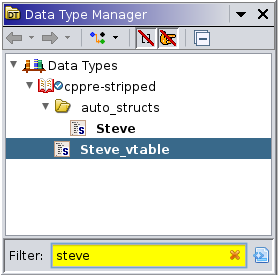

Edit the data type and name the elements of the structure the same 
way you named the functions and save that.  You'll see why in a minute.

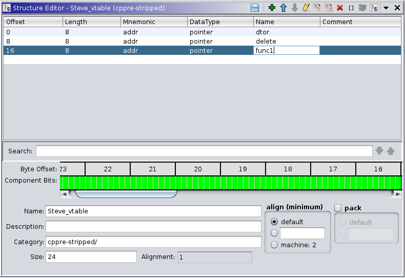

Finally, edit the Steve structure itself one more time.  You should
be able to find it also in the Data Type Manager.  Change the type of the
vtable from an anonymous pointer to a ``Steve_vtable *``

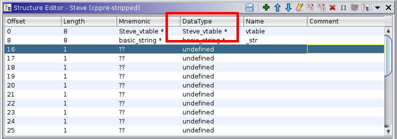

Now when you go look at ``main`` things should look a bit different.  The
biggest change is that the unknown indirect function is now known!  It took
a lot of work to get there but these kinds of things really help understand
C++ code.  

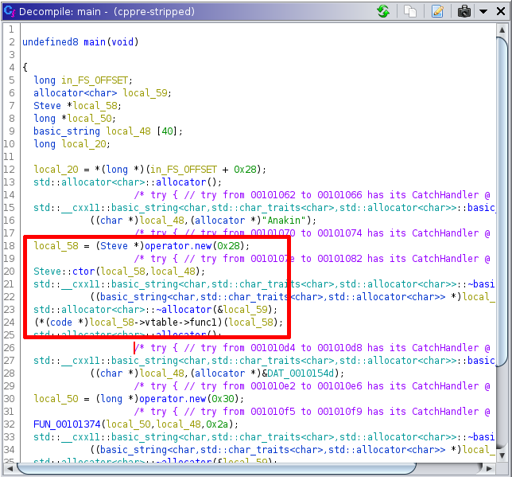

The only annoying thing is that you have Steve defined in three places,
the struct, the class, and the vtable.  If you want to change from Steve to
something more meaningful, you will need to update it in 3 places.  Likewise if
you discover what ``func1`` is, you will have to change it in the vtable struct
in addition to the function name.

Who calls this?
___________________

Sometimes when auditing C++ code you may also come across functions
that look orphaned.  Once again, you should recognize this as function
indirection.  To simulate this, run Archaea on this binary like the
previous tool guide.  This time though, sort on the ``CalledBy`` column
and you should see a bunch of functions that look as if they are called
by nobody.  Click on the biggest one of these to navigate to it.

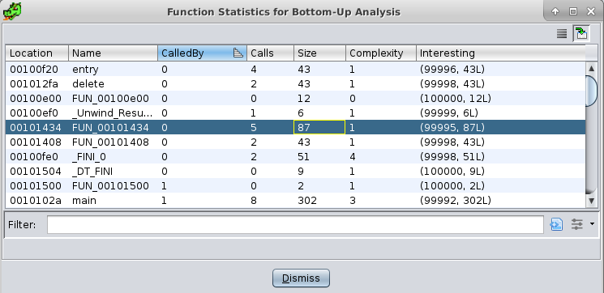

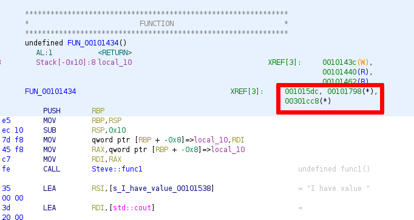

The important thing to notice here in the listing view is that there
are no XREFS to other functions.  So if you were trying to backtrack
through this function, at this point you would be stuck.  There are however
data references and if you click on one of them, you should be comforted
by something that looks a lot like a vtable.

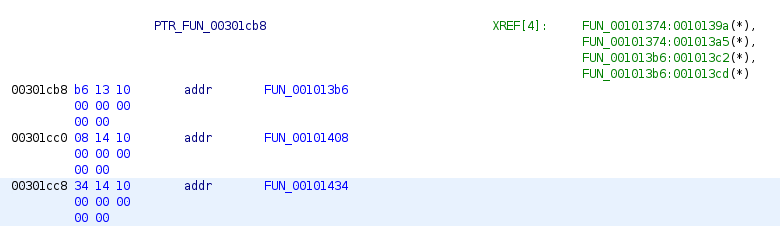

The vtable itself has XREFS to other locations and that should put you
in a familiar place according to what we have done so far.  See if you
can complete the rest of the RE on this new class.

The source code that generated this binary is `here
<../../../_static/cppre.cpp>`_ if you want to compare it to what you are
seeing in Ghidra.  Don't look at it until you are done reversing!
