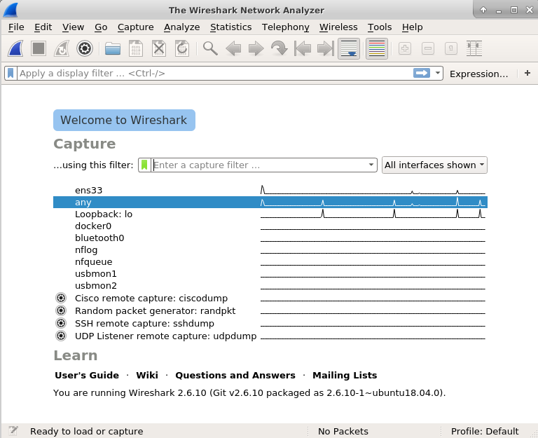
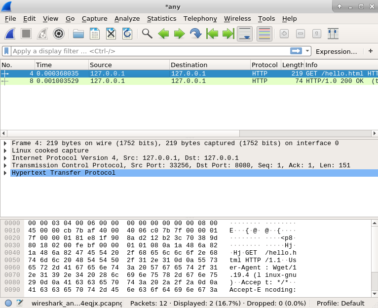
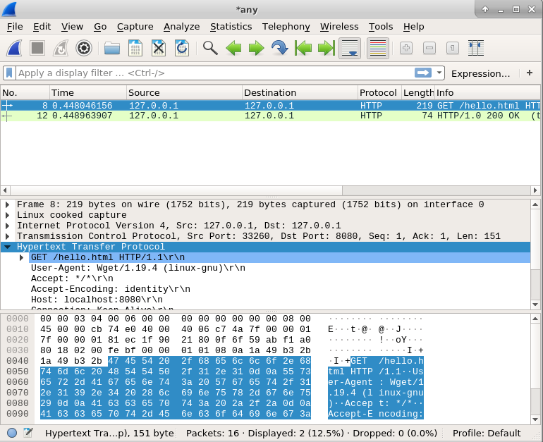

.. Copyright 2022 National Technology & Engineering Solutions of Sandia, LLC
   (NTESS).  Under the terms of Contract DE-NA0003525 with NTESS, the U.S.
   Government retains certain rights in this software.
   
   Redistribution and use in source and binary/rendered forms, with or without
   modification, are permitted provided that the following conditions are met:
   
    1. Redistributions of source code must retain the above copyright notice,
       this list of conditions and the following disclaimer.
    2. Redistributions in binary/rendered form must reproduce the above copyright
       notice, this list of conditions and the following disclaimer in the
       documentation and/or other materials provided with the distribution.
    3. Neither the name of the copyright holder nor the names of its contributors
       may be used to endorse or promote products derived from this software
       without specific prior written permission.
   
   THIS SOFTWARE IS PROVIDED BY THE COPYRIGHT HOLDERS AND CONTRIBUTORS "AS IS" AND
   ANY EXPRESS OR IMPLIED WARRANTIES, INCLUDING, BUT NOT LIMITED TO, THE IMPLIED
   WARRANTIES OF MERCHANTABILITY AND FITNESS FOR A PARTICULAR PURPOSE ARE
   DISCLAIMED. IN NO EVENT SHALL THE COPYRIGHT HOLDER OR CONTRIBUTORS BE LIABLE
   FOR ANY DIRECT, INDIRECT, INCIDENTAL, SPECIAL, EXEMPLARY, OR CONSEQUENTIAL
   DAMAGES (INCLUDING, BUT NOT LIMITED TO, PROCUREMENT OF SUBSTITUTE GOODS OR
   SERVICES; LOSS OF USE, DATA, OR PROFITS; OR BUSINESS INTERRUPTION) HOWEVER
   CAUSED AND ON ANY THEORY OF LIABILITY, WHETHER IN CONTRACT, STRICT LIABILITY,
   OR TORT (INCLUDING NEGLIGENCE OR OTHERWISE) ARISING IN ANY WAY OUT OF THE USE
   OF THIS SOFTWARE, EVEN IF ADVISED OF THE POSSIBILITY OF SUCH DAMAGE.

.. _wireshark:

Wireshark
=============

.. note::

 Wireshark should be setup for you inside the VM but if you set it up yourself
 you will have to go through some configuration.  By default, Wireshark needs
 raw socket access which is usually a privileged thing.  In Linux, this
 requires adding your user to the wireshark group.  In Windows or MacOS, you
 may have to Google for how to properly run Wireshark.

When you first start Wireshark, you should see a screen where you can choose
which interfaces you wish to capture.  Before you do, let's setup something to capture.
In a terminal run a python web server:

.. code::

 $ echo hello > hello.html
 $ python -m http.server 8080

Select ``any`` in the interface list and click on the shark fin icon.  This will
start capturing traffic.  Now use ``wget`` to retrieve the file we setup in the web
server.

.. code::

 $ wget http://localhost:8080/hello.html

You should then stop capturing packets by clicking the red square icon.  The result
should be a variety of packets in the table.

Click on the first HTTP packet.  This should contain your GET request from ``wget``.
You can click on the elements of the packet in the window beneath the packet list.  As
you click on the components of the packet, different bytes of the packet will be selected
in the window below that showing you what bytes belong to which part of the network stack.
Click on ``Hypertext Transfer Protocol`` and notice that the bytes start with ``GET``
which is the application layer protocol for HTTP.

You can right click on that row instead and choose ``Export Packet Bytes`` which
will save that to a binary file.  Make sure you save everything beneath the TCP layer.

You can now duplicate what was done by ``wget`` but with pure sockets.  Consider this
python script:

.. code::

 import socket
 import sys
 import hexdump
 
 with open('http.bin', 'rb') as f:
     payload = f.read()
 
 if len(sys.argv) != 2:
     print("{} <ip>".format(sys.argv[0]))
     sys.exit(1)
 
 ip = sys.argv[1]
 s = socket.socket(socket.AF_INET, socket.SOCK_STREAM)
 
 print("Sending:")
 hexdump.hexdump(payload)
 
 s.connect((ip,8080))
 s.sendall(payload)
 
 data = s.recv(1000)
 print("Received:")
 hexdump.hexdump(data)

If you saved the output of your wireshark packet to ``http.bin``, this will
read that in and simply pipe it back out over TCP.  If you run this script you
get the following output:

.. code::

 Sending:
 00000000: 47 45 54 20 2F 68 65 6C  6C 6F 2E 68 74 6D 6C 20  GET /hello.html
 00000010: 48 54 54 50 2F 31 2E 31  0D 0A 55 73 65 72 2D 41  HTTP/1.1..User-A
 00000020: 67 65 6E 74 3A 20 57 67  65 74 2F 31 2E 31 39 2E  gent: Wget/1.19.
 00000030: 34 20 28 6C 69 6E 75 78  2D 67 6E 75 29 0D 0A 41  4 (linux-gnu)..A
 00000040: 63 63 65 70 74 3A 20 2A  2F 2A 0D 0A 41 63 63 65  ccept: */*..Acce
 00000050: 70 74 2D 45 6E 63 6F 64  69 6E 67 3A 20 69 64 65  pt-Encoding: ide
 00000060: 6E 74 69 74 79 0D 0A 48  6F 73 74 3A 20 6C 6F 63  ntity..Host: loc
 00000070: 61 6C 68 6F 73 74 3A 38  30 38 30 0D 0A 43 6F 6E  alhost:8080..Con
 00000080: 6E 65 63 74 69 6F 6E 3A  20 4B 65 65 70 2D 41 6C  nection: Keep-Al
 00000090: 69 76 65 0D 0A 0D 0A                              ive....
 Recieved:
 00000000: 48 54 54 50 2F 31 2E 30  20 32 30 30 20 4F 4B 0D  HTTP/1.0 200 OK.
 00000010: 0A 53 65 72 76 65 72 3A  20 53 69 6D 70 6C 65 48  .Server: SimpleH
 00000020: 54 54 50 2F 30 2E 36 20  50 79 74 68 6F 6E 2F 33  TTP/0.6 Python/3
 00000030: 2E 38 2E 30 0D 0A 44 61  74 65 3A 20 53 75 6E 2C  .8.0..Date: Sun,
 00000040: 20 32 32 20 41 75 67 20  32 30 32 31 20 31 38 3A   22 Aug 2021 18:
 00000050: 33 32 3A 33 30 20 47 4D  54 0D 0A 43 6F 6E 74 65  32:30 GMT..Conte
 00000060: 6E 74 2D 74 79 70 65 3A  20 74 65 78 74 2F 68 74  nt-type: text/ht
 00000070: 6D 6C 0D 0A 43 6F 6E 74  65 6E 74 2D 4C 65 6E 67  ml..Content-Leng
 00000080: 74 68 3A 20 36 0D 0A 4C  61 73 74 2D 4D 6F 64 69  th: 6..Last-Modi
 00000090: 66 69 65 64 3A 20 53 75  6E 2C 20 32 32 20 41 75  fied: Sun, 22 Au
 000000A0: 67 20 32 30 32 31 20 31  38 3A 31 34 3A 35 32 20  g 2021 18:14:52
 000000B0: 47 4D 54 0D 0A 0D 0A 68  65 6C 6C 6F 0A           GMT....hello.

This should look remarkably familiar to the data you saw in Wireshark.
To play around with this, look in wireshark at the components of the HTTP
protocol.  Change them in your binary file and try to get different behavior
out of your mini web server.  The simplest thing will be to get a different
file you place in the directory you are serving.
